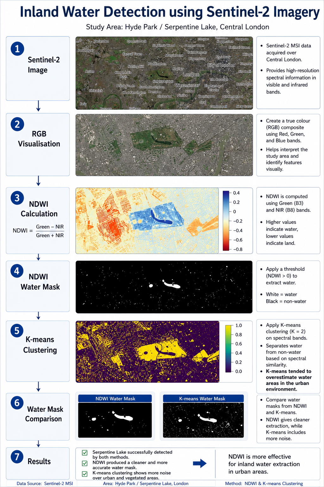
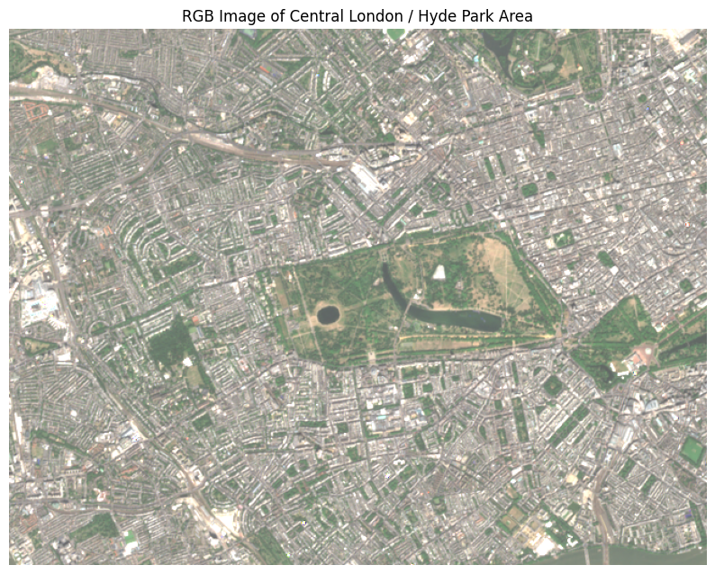
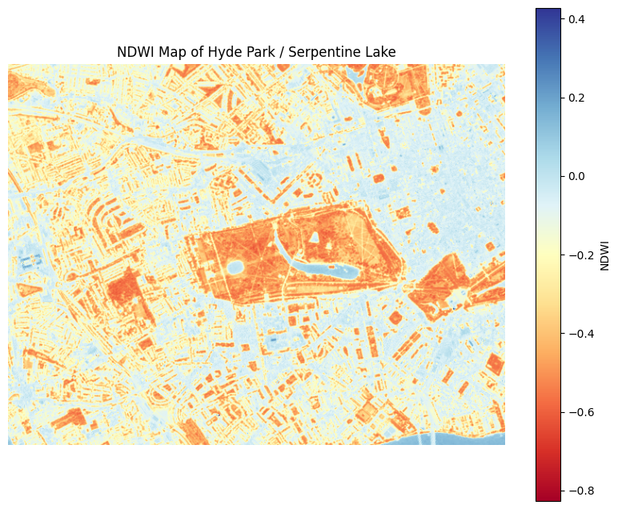
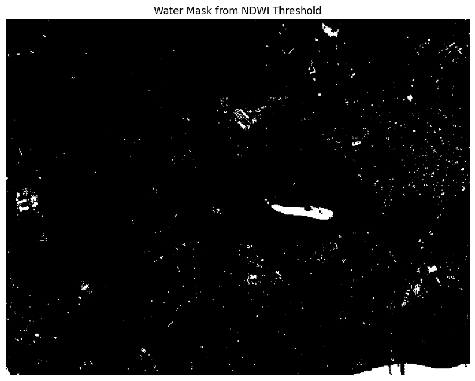
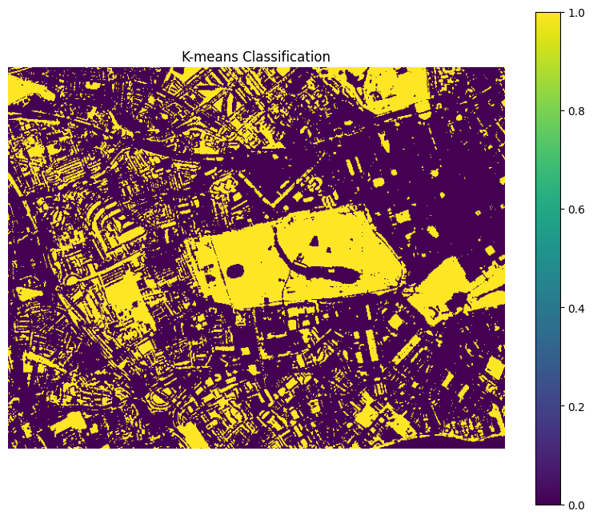
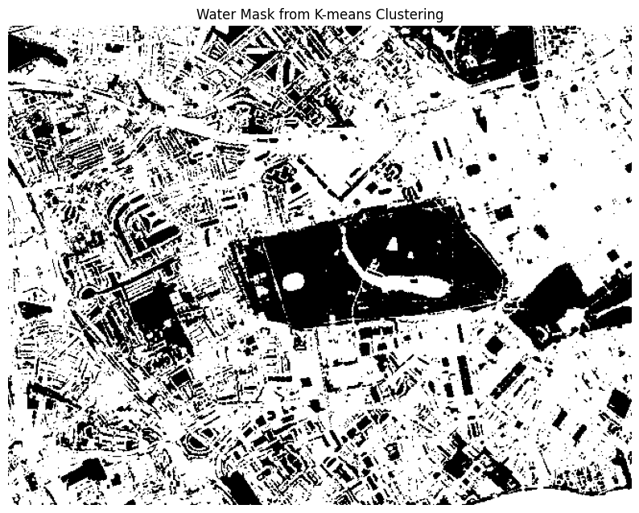

# GEOL0069 – Inland Water Detection using Sentinel-2 Imagery

## Project Overview

This project investigates whether Sentinel-2 satellite imagery can be used to detect inland water bodies in an urban environment.

The study focuses on the Serpentine Lake located in Hyde Park, Central London. Water detection was performed using the Normalized Difference Water Index (NDWI) and K-means clustering. The results from both methods were compared to evaluate their effectiveness for urban water extraction.

---

## Video Presentation

YouTube Link:

[https://youtu.be/xxxxxxxx](https://youtu.be/8oTAQ1wLK-A?si=g88PQmhuiYm9AvB0)

---

## Study Area

- Location: Hyde Park / Serpentine Lake, Central London
- Satellite: Sentinel-2 MSI
- Spectral bands used:
  - B3 (Green)
  - B4 (Red)
  - B8 (Near Infrared)

---

## Methodology

The workflow used in this project is shown below.

### Processing Steps

1. Sentinel-2 image acquisition
2. RGB visualisation
3. NDWI calculation
4. NDWI water mask generation
5. K-means clustering (K = 2)
6. Water mask comparison
7. Result evaluation

---

## Workflow Diagram

---

## Results

### NDWI Water Detection

NDWI successfully identified the Serpentine Lake and produced a relatively clean water mask.

### K-means Clustering

K-means clustering was able to separate water and non-water pixels but introduced significantly more noise in urban and vegetated areas.

### Comparison

| Method | Observation |
|----------|----------|
| NDWI | Produced a cleaner water mask |
| K-means | Overestimated water areas and introduced noise |
| Overall | NDWI performed better for this study area |

---

## Key Figures

### RGB Image

### NDWI Map

### NDWI Water Mask

### K-means Classification

### K-means Water Mask

---

## Environmental Cost

This project used freely available Sentinel-2 satellite imagery and Google Colab cloud computing resources.

Compared with traditional field-based surveys, remote sensing approaches reduce transportation requirements and minimise environmental disturbance.

Although cloud computing consumes electricity, the environmental impact of this study remains relatively low because of the small dataset and lightweight processing workflow.

---

## Limitations

Several limitations should be noted:

- Only one Sentinel-2 scene was analysed.
- K-means clustering used only two classes.
- No ground-truth validation data were available.
- Urban shadows and vegetation occasionally caused classification errors.

Future work could include additional Sentinel-2 scenes, alternative water indices, and more advanced machine learning approaches.

---

## Files

| File | Description |
|--------|--------|
| GEOL0069_Inland_Water_Detection.ipynb | Main project notebook |
| rgb.png | RGB visualisation |
| ndwi_map.png | NDWI map |
| ndwi_mask.png | NDWI water mask |
| kmeans_classification.png | K-means classification result |
| kmeans_mask.png | K-means water mask |

---

## References

McFeeters, S. K. (1996). The use of the Normalized Difference Water Index (NDWI) in the delineation of open water features.

European Space Agency (ESA). Sentinel-2 User Guide.

Scikit-learn Developers. K-means Clustering Documentation.
